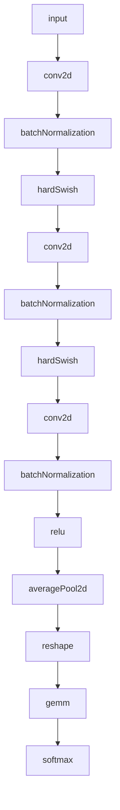
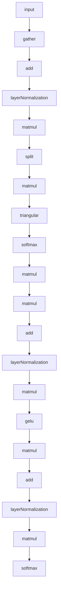
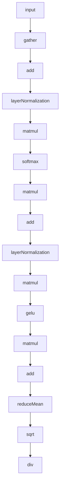
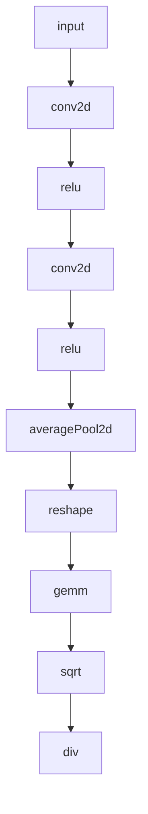

# WebNN operators and example graphs

This document summarizes WebNN operators with short explanations, followed by a **spec-aligned overview of operator I/O types**, and simplified example graphs showing how those operators are typically composed in real models.

This content is aligned with the **official WebNN (W3C) specification**.  
Individual operators do not repeat I/O types; instead, types are defined once in a dedicated section, as in the spec itself.

---

## WebNN operator list (one sentence each)

### Selection / indexing
- argMax: Returns the index of the maximum value along an axis, useful for selecting a predicted class.
- argMin: Returns the index of the minimum value along an axis, useful for selecting lowest-cost values.

### Normalization
- batchNormalization: Normalizes activations using running statistics, useful in convolutional networks.
- instanceNormalization: Normalizes per-sample per-channel, useful in style transfer and some vision models.
- layerNormalization: Normalizes across feature dimensions, useful in Transformers and MLPs.

### Shape / type
- cast: Converts a tensor to another data type, useful for compatibility and quantization pipelines.
- reshape: Changes tensor shape without changing data, useful between layers.
- transpose: Permutes axes, useful for layout changes and attention math.
- expand: Broadcasts a tensor to a larger shape, useful for alignment.
- tile: Repeats tensor data, useful when broadcasting is insufficient.
- split: Splits a tensor into multiple tensors along an axis, useful for Q/K/V separation.
- concat: Concatenates tensors along an axis, useful for feature fusion.
- pad: Pads tensor edges, useful for convolutions and shape alignment.
- slice: Extracts a sub-tensor, useful for cropping and windowing.
- reverse: Reverses elements along an axis, useful for sequence manipulation.

### Core math
- matmul: Performs matrix multiplication, the core operation for attention and dense layers.
- gemm: Performs matrix multiplication with optional bias and transpose, useful for dense layers.
- conv2d: Applies 2D convolution, useful for spatial feature extraction.
- convTranspose2d: Applies transposed convolution, useful for learned upsampling.
- averagePool2d: Downsamples by averaging, useful for smoothing and global pooling.
- maxPool2d: Downsamples by maximum value, useful for spatial invariance.
- l2Pool2d: Downsamples using L2 norm, useful for magnitude-based pooling.
- resample2d: Resizes 2D tensors, useful for upsampling or downsampling.

### Element-wise binary
- add: Adds tensors element-wise, useful for residual connections.
- sub: Subtracts tensors element-wise, useful for differences.
- mul: Multiplies tensors element-wise, useful for scaling and gating.
- div: Divides tensors element-wise, useful for normalization.
- max: Computes element-wise maximum, useful for clipping or comparisons.
- min: Computes element-wise minimum, useful for bounds.
- pow: Raises elements to a power, useful for polynomial transforms.

### Element-wise unary
- abs: Absolute value, useful for magnitude features.
- ceil: Rounds values up, useful for discretization.
- floor: Rounds values down, useful for discretization.
- roundEven: Rounds to nearest even integer, useful for deterministic rounding.
- neg: Negates values, useful for sign inversion.
- exp: Exponential function, useful for softmax and log-domain math.
- log: Natural logarithm, useful for log-probabilities.
- sqrt: Square root, useful for variance and normalization.
- reciprocal: Computes 1/x, useful for inverse scaling.
- sin: Sine function, useful for positional encodings.
- cos: Cosine function, useful for positional encodings.
- tan: Tangent function, rarely used but available.
- erf: Error function, used in GELU-like activations.
- sign: Returns sign of values, useful in some loss formulations.
- identity: Returns input unchanged, useful as a graph placeholder.

### Activations
- relu: Applies ReLU activation, the standard cheap nonlinearity.
- leakyRelu: ReLU with negative slope, avoids dead neurons.
- prelu: Parametric ReLU with learned slope.
- elu: Exponential Linear Unit, smooth alternative to ReLU.
- gelu: Gaussian Error Linear Unit, standard in Transformers.
- sigmoid: Logistic activation, useful for probabilities and gates.
- tanh: Hyperbolic tangent activation, useful for bounded outputs.
- hardSigmoid: Piecewise linear sigmoid, useful on low-power devices.
- hardSwish: Piecewise linear swish, common in mobile CNNs.
- softplus: Smooth ReLU producing positive outputs.
- softsign: Smoothly squashes values into (-1, 1).

### Reductions
- reduceSum: Sums values along axes, useful for aggregation.
- reduceMean: Averages values along axes, useful for pooling.
- reduceMax: Computes maximum along axes, useful for global pooling.
- reduceMin: Computes minimum along axes, useful for bounds.
- reduceProduct: Multiplies values along axes, niche use.
- reduceL1: Sum of absolute values, useful for L1 norms.
- reduceL2: L2 norm computation, useful for normalization.
- reduceSumSquare: Sum of squared values, useful for energy metrics.
- reduceLogSum: Log of summed values, niche probabilistic use.
- reduceLogSumExp: Log-sum-exp, useful for numerically stable logits.

### Comparison / logical
- equal: True where values are equal, useful for masks.
- notEqual: True where values differ.
- greater: True where a > b.
- greaterOrEqual: True where a ≥ b.
- lesser: True where a < b.
- lesserOrEqual: True where a ≤ b.
- logicalNot: Logical negation.
- logicalAnd: Logical AND.
- logicalOr: Logical OR.
- logicalXor: Logical XOR.
- isNaN: True where values are NaN.
- isInfinite: True where values are infinite.

### Quantization
- quantizeLinear: Converts floats to quantized integers.
- dequantizeLinear: Converts quantized integers back to floats.

### Indexing / scatter
- gather: Index-based lookup, commonly used for embeddings.
- gatherElements: Element-wise gather using an index tensor.
- gatherND: N-dimensional gather, useful for structured indexing.
- scatterElements: Writes values at indexed positions.
- scatterND: Writes values using N-D indices.
- where: Selects values based on a condition mask.

### Sequence / recurrent
- gru: Gated Recurrent Unit over sequences.
- gruCell: Single GRU step.
- lstm: LSTM over sequences.
- lstmCell: Single LSTM step.

### Other
- linear: Applies affine transform (a * x + b).
- triangular: Extracts lower or upper triangular matrix, useful for causal masking.
- cumulativeSum: Computes prefix sums along an axis.

---

## Operator I/O types (spec-aligned)

This section summarizes **typical input/output tensor types**, following the WebNN specification’s type system.

### Numeric tensor types
- float32, float16: primary computation types
- integer types: used for indices and quantization
- quantized integers: used only by explicit quantization operators
- boolean-like masks: produced by comparison/logical ops

### I/O rules by operator category

- Convolution, matmul, gemm, pooling, normalization, activations  
  Input: float32 / float16  
  Output: same as input type

- Element-wise arithmetic and unary math  
  Input: float32 / float16  
  Output: same as input type

- Reduction operators  
  Input: float32 / float16  
  Output: same numeric type, reduced shape

- Shape-only operators (reshape, transpose, expand, tile, pad, slice, reverse)  
  Input: any numeric tensor  
  Output: same type as input

- Comparison and logical operators  
  Input: numeric tensors  
  Output: boolean-like mask tensor

- argMax / argMin  
  Input: numeric tensor  
  Output: integer index tensor

- Gather / scatter operators  
  Input: data tensor + integer indices  
  Output: same data type as input tensor

- where  
  Input: mask tensor + numeric tensors  
  Output: numeric tensor

- Quantization operators  
  quantizeLinear: float → quantized integer  
  dequantizeLinear: quantized integer → float

- Sequence operators (gru, lstm, and cell variants)  
  Input: float32 / float16  
  Output: same numeric type

---

## Example WebNN graphs (operators only), with step-by-step rationale

### 1) MobileNet-style image classifier

Use case: efficient on-device image classification.

Graph:

Why each step is there:
- input: An image tensor (typically H×W×C or N×C×H×W) enters the model.
- conv2d: Extracts local spatial features (edges/textures) and builds feature maps.
- batchNormalization: Stabilizes the distribution of activations and improves numerical behavior.
- hardSwish: Provides nonlinearity with mobile-friendly compute cost.
- conv2d: Another convolution stage; in MobileNet-like designs this is commonly the depthwise spatial filtering stage.
- batchNormalization: Keeps activations well-scaled after the convolution.
- hardSwish: Nonlinearity after the depthwise stage to increase representational power.
- conv2d: A final convolution stage; in MobileNet-like designs this is commonly the pointwise (1×1) mixing stage across channels.
- batchNormalization: Stabilizes activations after channel mixing.
- relu: A simple nonlinearity (some variants use relu/hardSwish consistently; this is schematic).
- averagePool2d: Global (or near-global) pooling collapses spatial dimensions, producing a single vector per channel.
- reshape: Flattens pooled features into a 2D (batch, features) shape for the classifier head.
- gemm: Dense classifier mapping features to class logits.
- softmax: Converts logits into a probability distribution over classes.

---

### 2) Simplest decoder-only text generator

Use case: autoregressive text generation (predict next token from previous tokens).

Graph:

Why each step is there:
- input: Token IDs (and implicitly a running context length) arrive as the prompt prefix.
- gather: Looks up token embeddings from an embedding table using token IDs.
- add: Adds positional information (position embedding or equivalent) into token representations.
- layerNormalization: Normalizes per-token features to stabilize attention/MLP computations.
- matmul: Projects embeddings into a combined QKV representation (often fused as one matmul).
- split: Separates the combined projection into Q, K, and V tensors.
- matmul: Computes attention scores by multiplying Q with transposed K.
- triangular: Applies a causal mask so position i cannot attend to positions > i.
- softmax: Normalizes masked attention scores into attention weights.
- matmul: Applies attention weights to V to produce the attention output (contextualized features).
- matmul: Output projection returns attention output to the model hidden dimension.
- add: Residual connection adds the attention output back to the input of the block.
- layerNormalization: Normalizes again before the feed-forward sublayer.
- matmul: First feed-forward (MLP) linear projection to a larger intermediate dimension.
- gelu: Nonlinear activation standard in many Transformer variants.
- matmul: Second feed-forward projection back to the hidden dimension.
- add: Residual connection adds MLP output back into the stream.
- layerNormalization: Final normalization before the output head (schematic; some models differ).
- matmul: Projects hidden states to vocabulary logits.
- softmax: Converts logits to a probability distribution used to pick the next token.

---

### 3) Vector embedder

#### 3a) Text embedder

Use case: sentence/document embeddings for search and similarity.

Graph:

Why each step is there:
- input: Token IDs for a sentence or document.
- gather: Maps each token ID to an embedding vector.
- add: Injects positional information into embeddings.
- layerNormalization: Stabilizes the representation before attention/MLP.
- matmul: Computes attention projections or attention scoring (schematic; attention uses multiple matmuls in full models).
- softmax: Normalizes attention weights.
- matmul: Applies attention weights to produce contextual token features.
- add: Residual connection preserves original signal and helps optimization.
- layerNormalization: Stabilizes features before feed-forward layers.
- matmul: Feed-forward projection to larger intermediate space.
- gelu: Adds nonlinearity to increase expressiveness.
- matmul: Projects back to embedding dimension.
- add: Residual connection.
- reduceMean: Pools token features into a single fixed-size vector (mean pooling).
- sqrt: Part of L2 normalization (computing vector norm).
- div: Completes L2 normalization so cosine similarity becomes a dot product.

#### 3b) Image embedder

Use case: image embeddings for similarity and clustering.

Graph:

Why each step is there:
- input: Image tensor.
- conv2d: Extracts early visual features (edges, corners).
- relu: Adds nonlinearity and sparsity.
- conv2d: Builds higher-level features by composing earlier ones.
- relu: Adds nonlinearity again.
- averagePool2d: Global pooling turns a feature map into a single vector per channel.
- reshape: Flattens pooled features into a vector for projection.
- gemm: Projects features into a target embedding space.
- sqrt: Part of L2 normalization (computing vector norm).
- div: Completes L2 normalization so dot products correspond to cosine similarity.

