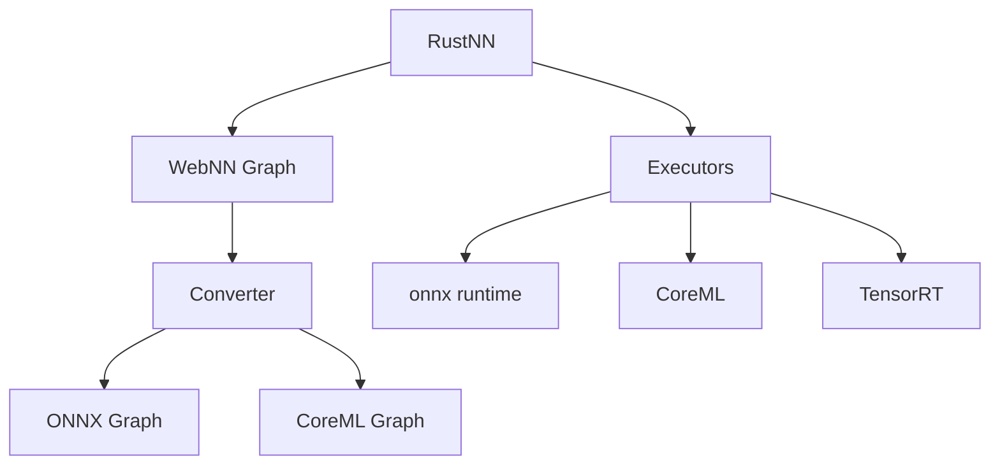
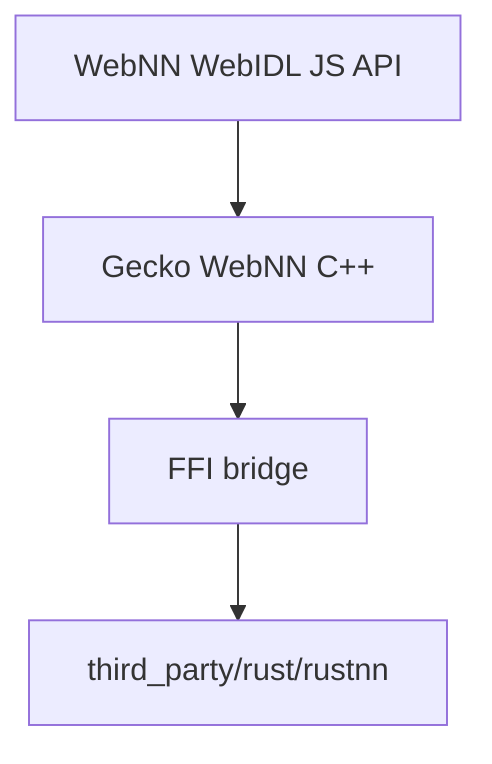

## RustNN: Rust implementation of WebNN

<div>
Tarek Ziadé, Mozilla
</div>
<div>
Thursday Dec 18
</div>

---

## What is rustnn?

* An **independent Rust implementation of the W3C WebNN API**.
* Exposes a thin Python API (PyWebNN) similar to the JS API.
* Built with Firefox integration as a primary target, but usable outside browsers.

---

## Motivation

* We want to add WebNN support in Firefox.
* Alternatives  
  * Chromium’s implementation is Blink-dependent.
  * `webnn-native` is stalled (2 years) and lacks modern backend support.
* Rust is the natural choice for new Gecko components.
* Python layer widens ML community reach.

---

## Design goals

* **Strict spec interpretation** — inputs are validated and shapes computed exactly as defined by the WebNN spec.
* **Backend independence** — WebNN graph semantics are decoupled from execution backends.
* **Early error detection** — invalid graphs rejected before backend lowering.
* **Testability** — architecture designed to support WPT ingestion and differential testing.
* **Not just for browsers** — Standalone rust lib, Python bindings broaden WebNN reach in ML communities.

---

## High-level architecture




---

## Simple and Pluggable Rust code base

* `src/graph.rs` — core graph structures and immutability guarantees
* `src/validator.rs` — WebNN spec validation rules
* `src/shape_inference.rs` — static shape computation
* `src/converters/` — lowering to ONNX / CoreML graph
* `src/executors/` — backend execution adapters (ONNX Runtime, CoreML, TensorRT)

---

## Minimal Python example (PyWebNN)

```
import webnn
import numpy as np

# Create ML context with device hints
ml = webnn.ML()
context = ml.create_context(accelerated=False)  # CPU execution
builder = context.create_graph_builder()

# Build a simple graph: output = relu(x + y)
x = builder.input("x", [2, 3], "float32")
y = builder.input("y", [2, 3], "float32")
z = builder.add(x, y)
output = builder.relu(z)

# Compile the graph
graph = builder.build({"output": output})

# Execute with real data
x_data = np.array([[1, -2, 3], [4, -5, 6]], dtype=np.float32)
y_data = np.array([[-1, 2, -3], [-4, 5, -6]], dtype=np.float32)
results = context.compute(graph, {"x": x_data, "y": y_data})

print(results["output"])
```

* Mirrors WebNN API structure (context → builder → graph).
* Validation and shape inference happen at `build()` time.
* Backend lowering happens at `compute()` time.

---

## Minimal Rust example

```
use rustnn::graph::GraphBuilder;
use rustnn::types::{TensorDesc, DataType};
use rustnn::context::Context;

fn main() -> anyhow::Result<()> {
    // execution context (backend selection happens later)
    let ctx = Context::default();
    let mut builder = GraphBuilder::new(&ctx);

    // input tensor description
    let x = builder.input(
        "x",
        TensorDesc::new(DataType::Float32, vec![1, 3]),
    )?;

    // y = relu(x)
    let y = builder.relu(&x)?;

    // build immutable graph
    let graph = builder.build(vec![("y", y)])?;

    // execute (backend chosen internally)
    let result = graph.compute(vec![("x", vec![1.0f32, -2.0, 3.0])])?;

    println!("{:?}", result["y"]);
    Ok(())
}
```

* Same conceptual phases as Python: context → builder → graph → compute.
* Graph is validated and shape-inferred before execution.
* Execution backend is selected at compute time.

---

## Firefox support



* Classical WebIDL for JS layer
* cbindgen for bridging rustnn to C++
* rustnn centralizes spec logic outside Gecko.
* Enables faster iteration and clearer separation of concerns.

---

## Screencast demo

<video controls autoplay loop muted style="max-width: 100%; height: auto;">
  <source src="https://cotedorclassicjuniors.fr/webnn-demo.mov" type="video/quicktime">
  Your browser does not support the video tag.
</video>

---

## Implementation status — Summary

* **85 WebNN operations implemented** (~89% of current spec).
* All implemented ops support:

  * validation
  * shape inference
  * ONNX, CoreML lowering
  * ONNX, CoreML (partial), TensorRT (experimental) execution
* Remaining gaps are tracked.

---

## Implementation status — Gaps

* **RNN family (`lstm`, `gru`, `rnn`)** — deferred

  * complex semantics
  * backend inconsistencies
  * open questions in spec text
* A small number of ops partially implemented where backend support diverges.
* CoreML partially implemented (Float16 😫).
* Firefox patch POC quality (IPC layer missing).

---

## WPT & conformance testing

* WPT WebNN conformance and validation tests converted into Python tests.
* ONNX backend: **1350 tests passing** for supported ops.
* CoreML backend: 
  * known executor bugs cause temporary skips.
  * **129 tests skipped** due to architectural or spec-related limitations (documented).

---

## Next steps

1. Finish WPT data conversion for remaining ops.
2. Implement more demos.
3. Finish TensortRT execution support
4. Work on performances
5. Improve documentation 

---

## Thanks!! Questions ?

* Repo: [https://github.com/tarekziade/rustnn](https://github.com/tarekziade/rustnn)
* Docs: [https://blog.ziade.org/rustnn](https://blog.ziade.org/rustnn/)


